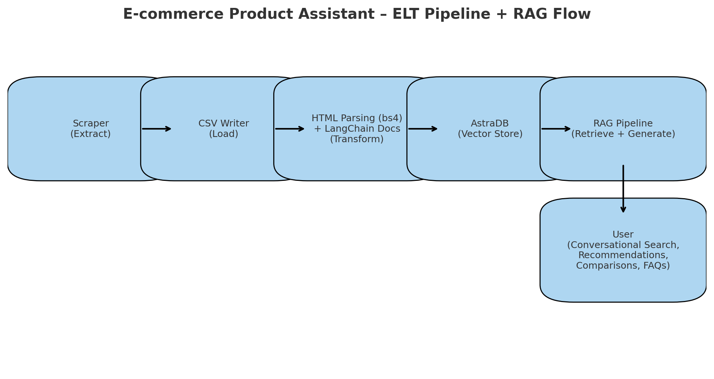

🛍️ E-commerce Product Assistant

## 📊 Architecture Diagram



# 🛍️ E-commerce Product Assistant
_A RAG-based Conversational AI Bot with ELT Pipeline_

## 📖 Overview
The **E-commerce Product Assistant** is an AI-powered conversational bot designed to enhance shopping experiences on e-commerce platforms.  
Built with **Retrieval-Augmented Generation (RAG)**, it retrieves product data from multiple sources (catalogs, FAQs, reviews, specifications)  
and generates **contextually accurate, natural responses**.  

Customers can **discover, compare, and explore products** through conversational interaction, reducing search friction and improving decision-making.  

---

## ✨ Key Features
- 🔎 **Intelligent product search** – Understands natural queries and retrieves the most relevant items.  
- 🎯 **Personalized recommendations** – Suggests products based on user intent and preferences.  
- 📊 **Product comparisons** – Provides side-by-side details for informed choices.  
- 💬 **Query handling** – Answers FAQs related to pricing, availability, delivery, and policies.  
- ⚡ **Scalable architecture** – Modular RAG pipelines ensure up-to-date and context-aware responses.  

This assistant acts as a **virtual shopping guide**, improving customer engagement, conversion rates, and satisfaction.  

---

## 🏗️ Architecture Flow (ELT Pipeline + RAG Assistant)
1. **Extract (Scraper)** – Real-time scraper pipeline fetches product data.  
2. **Load (CSV Writer)** – Raw product details stored in `.csv` files.  
3. **Transform (Parser + LangChain)**  
   - HTML parsing with **BeautifulSoup (bs4)**  
   - Convert into **LangChain Document objects**  
4. **Store (Vector DB – AstraDB)** – Embed & store in **AstraDB vector DB** for semantic search.  
5. **Retrieval-Augmented Generation (RAG)** – User query → retrieve relevant data → generate response.  
6. **User Experience** – Conversational search, recommendations, comparisons, and FAQs.  

📌 **Pipeline Overview:**  
`Scraper → CSV → HTML Parsing (bs4) → LangChain Docs → AstraDB (Vector DB) → RAG Pipeline → User`  

---

## ⚙️ Setup & Installation

### 1. Verify Python Installation
```bash
python --version
```

If not installed, download Python (3.10 / 3.11 / 3.12 recommended).  

### 2. Check if `uv` is Installed
```bash
uv --version
```
If not found, install with:  
```bash
pip install uv
```

Verify installation:
```python
import shutil
print(shutil.which("uv"))
```

### 3. Initialize Project
```bash
uv init <my-project-name>
uv pip list
uv python list
```

### 4. Create Virtual Environment
Windows (CMD):
```bash
uv venv env --python cpython-3.10.18-windows-x86_64-none
.\env\Scriptsctivate.bat
```

Mac/Linux (Git Bash / WSL / Terminal):
```bash
uv venv env --python 3.10
source env/Scripts/activate
```

### 5. Install Dependencies
```bash
uv add <package_name>
uv add -r requirements.txt
```

### 6. Run Streamlit App
```bash
streamlit run <your_streamlit_file.py>
```

### 7. Run HTML Files (Frontend Testing)
Install **Live Server Extension** in VS Code → Right-click HTML file → "Open with Live Server".  

---

## 🔑 Git Setup (if pushing to GitHub)
```bash
git config --global user.name "Your Name"
git config --global user.email "your-email@example.com"
```

---

## ☁️ AstraDB Setup
- Sign up / log in: [DataStax Account](https://accounts.datastax.com/session-service/v1/login)  
- Access Astra DB Console: [AstraDB](https://astra.datastax.com/)  
- Set up **Vector Database** instance for product embeddings.  

---

## 📌 Tech Stack
- **Python** (3.10 / 3.11 / 3.12)  
- **BeautifulSoup (bs4)** – HTML Parsing  
- **LangChain** – Document Transformation & RAG pipeline  
- **AstraDB** – Vector Database for semantic search  
- **Streamlit** – Conversational UI  
- **Scraper Pipeline** – Real-time product ingestion  
- **uv** – Project & dependency management  

---

## 🚀 Future Enhancements
- 🔧 Add product review sentiment analysis  
- 🤖 Integrate recommendation models for personalization  
- 🌐 Multi-lingual support for global e-commerce  
